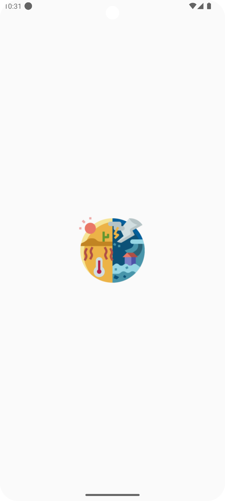
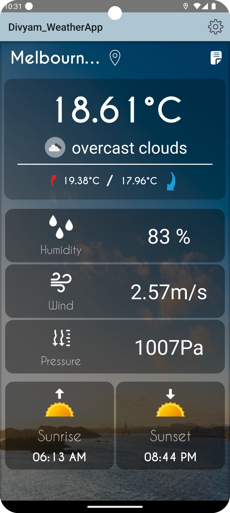
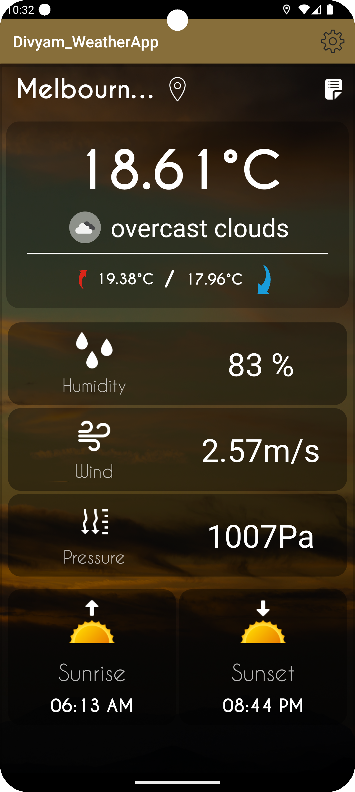
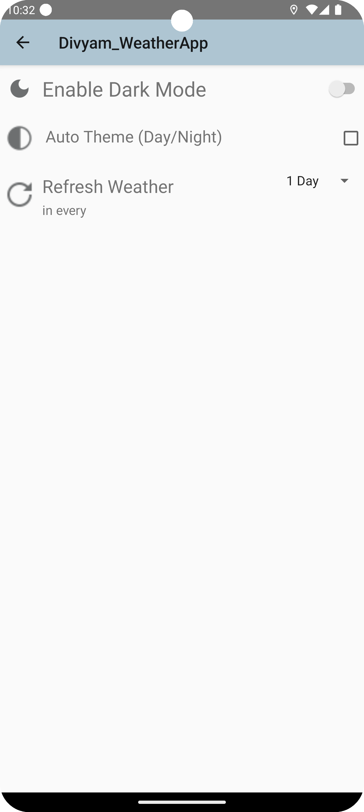
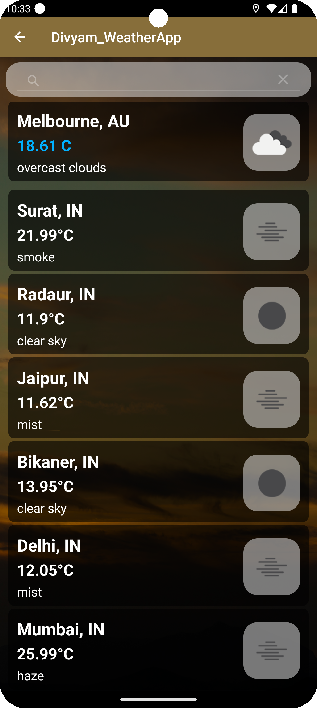

<h1 style="font-size:48px;"> ☀️ WeatherApp</h1>

<h2 style="font-size:36px;">WeatherApp is a simple and intuitive weather application designed to provide users with real-time weather updates. Stay informed about current conditions, forecasts, and alerts with an easy-to-use interface.</h2>

---

<h2 style="font-size:36px;"> 🌟 Features</h2>

- 🌍 **Global Weather Updates**: Access weather information for locations around the world.
- ⏱️ **Real-Time Data**: Stay updated with current weather conditions.
- 📅 **Weekly Forecast**: Plan your week with detailed forecasts.
- ⚠️ **Weather Alerts**: Get notified about severe weather conditions.
- 🎨 **User-Friendly Interface**: Enjoy a clean and straightforward UI.

---

<h2 style="font-size:36px;"> 🚀 Installation</h2>

To get started with **WeatherApp**, follow these steps:

- Clone the Repository : git clone https://github.com/divyam082003/Weatherapp.git

<h2 style="font-size:36px;">Screenshots</h2>

  
  
  
  
   

